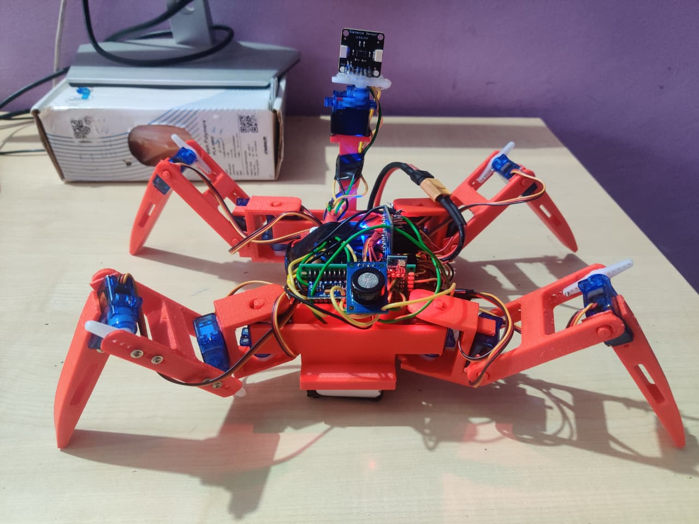

# Open-source quadruped robot
A fully open-source quadruped robot featuring custom CAD, PCB electronics, and Arduino-based walking firmware.

# CAD

| | |
| --------------------------- | --------------------------- |

# Angular legs

| | |
| --------------------------- | --------------------------- |

# CIRCUIT DESIGN
| | |
| --------------------------- | --------------------------- |

